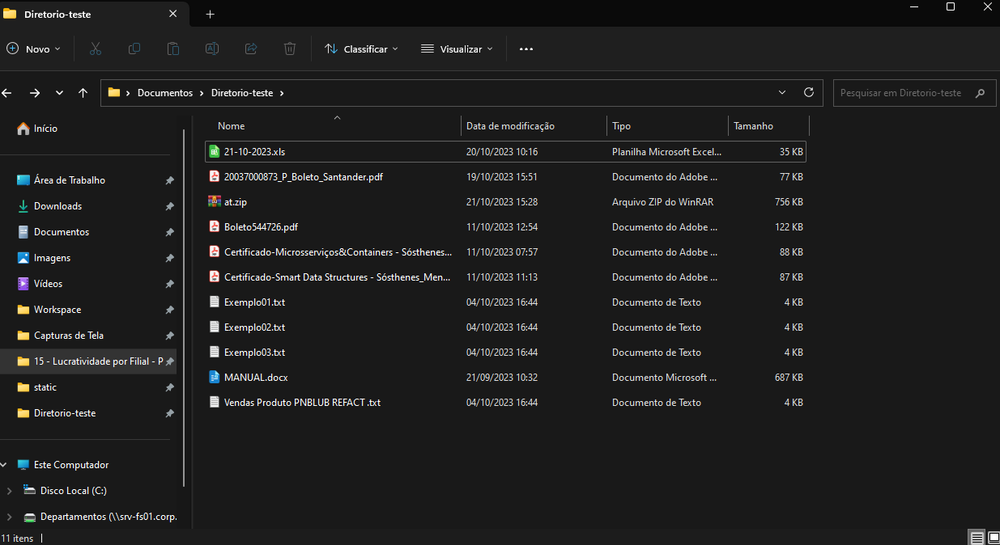
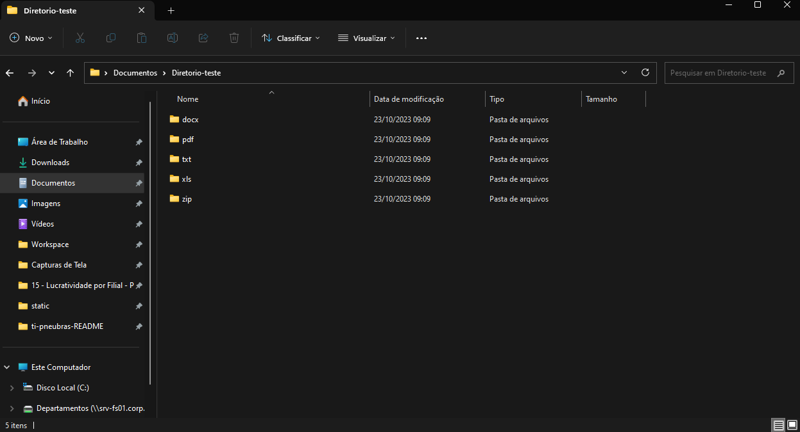
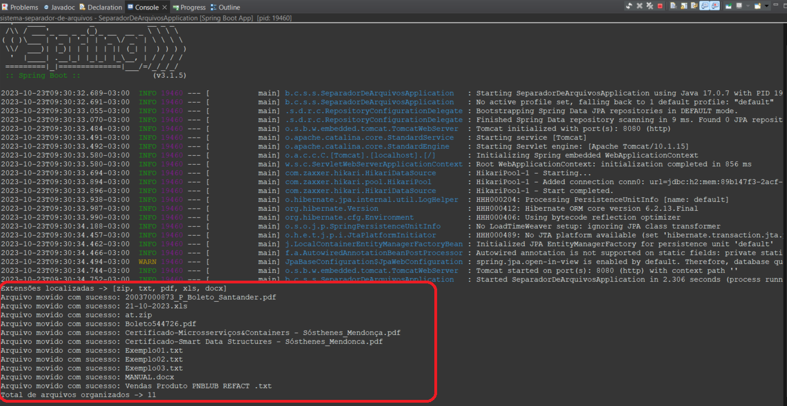

## Sistema Separador de Arquivos

Sistema desenvolvido em java para realizar a leitura e organização dos arquivos em um mesmo diretório a partir da sua extensão.

#### Diretório antes:

  

 
 

#### ***********************************************************************************************

#### Diretório depois:

  

 

#### ***********************************************************************************************

#### Diretório txt organizado:

  

 

#### ***********************************************************************************************

#### Saída do console:

  

 
